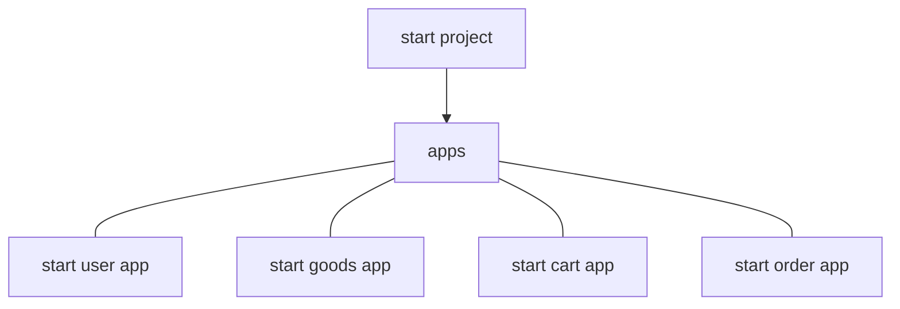

1. 把apps加入到搜索路径, 修改project下settings.py

   ```
   import sys
   sys.path.insert(0, os.path.join(BASE_DIR, 'apps'))
   ```

2. 数据库，templates, static file，urls,各个文件目录下的urls

3. 新建db package,base_model继承models,

   >base_model.py
   >
   >```
   >from django.db import models
   >class BaseModels(models.Model):
   >	create_time = models.DateTimeField(auto_now_add = True,verbose_name = '添加时间')
   >	update_time = models.DateTimeField(auto_now=True, verbose_name='修改时间')
   >	is_delete = models.BooleanField(deafault=False,verbose='是否删除')
   >	class Meta:
   >		#抽象模型类
   >		abstract = True
   >```

4. user model

   >创建user model，引入abstract
   >
   >```
   >from django.contrib.auth.models import Abstract
   >```
   >
   >更改project下settings.py
   >
   >```
   >AUTH_USER_MODEL = "app_name.class_name"
   >```

5. 引用富文本

6. 生成迁移文件，迁移数据库


<hr>

1. static 文件，image, js,css
2. template文件，register.html, base.html,base_foot.html
<<<<<<< HEAD

<hr>

```sequence
title: flow

#object


participant web as A

#project:p
participant p_urls as B

#app
participant a_urls as C
participant a_views as D

participant DB as E
participant template as F


A->B: 1.request

note over B: include app urls
B->C: 2.forward to app urls

note over C: app_name, urlpatterns
C->D: 3.find views func

note over D: deal with data
D->E: 4.get data
E->D: 5.return data

F-->D: 6.渲染模板
D-->A: 7.返回给web前端


```

=======
3. app_name写到app下的urls.py, 在views下调用app_name:name
>>>>>>> 22e6a6447acd24b59bbdc79acdc5f48c3b9c5708
